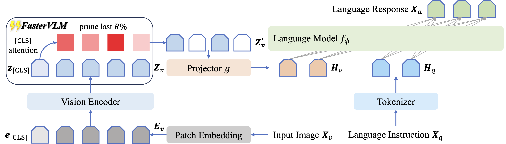
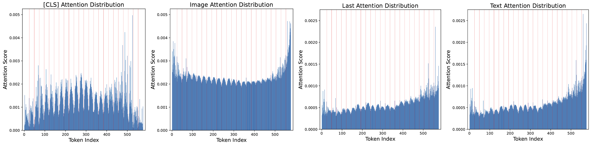
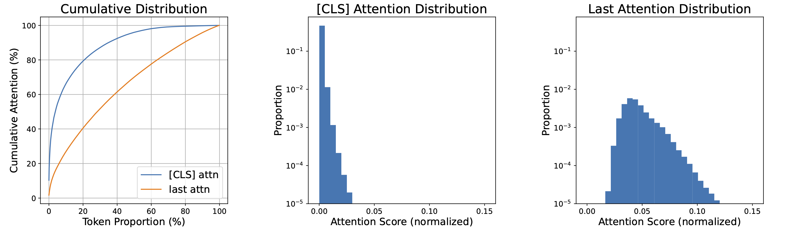
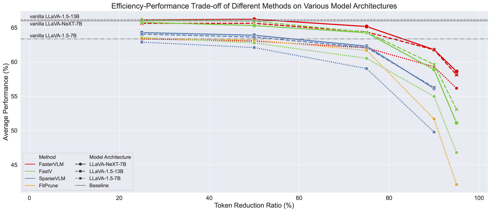

# ⚡️ [CLS] Attention is All You Need for Training-Free Visual Token Pruning: Make VLM Inference Faster

*A simple yet effective training-free token pruning method that evaluates the importance of visual tokens more accurately by [CLS] attentions, making VLM inference faster.*

[📄 [Paper](https://arxiv.org/abs/2412.01818)] [🎞️ [Project Page](https://theia4869.com/FasterVLM/)]

## 👁️ Overview

In this work, we find that the **text-visual attention** within the LLMs of current VLMs **fails to align well** with the actual significance of visual tokens, meaning that the attention weights assigned to each visual token do not correspond appropriately to their importance in the task. Compared to text-visual attention, **[CLS] attention** is more **concentrated**, serving as a better indicator for evaluating the importance of visual tokens. In **FasterVLM**, we first re-rank image tokens using [CLS] attention from the visual encoder and prune the last R%. The remaining image tokens, after passing through the multi-modal projector, are combined with language instructions as input to the language model for response generation. Since redundant image tokens are removed before the language model, FasterVLM can make the inference of the entire VLM even **faster** than pruning within the language model.



## ⚙️ Setup

### 🏝️ Environment

1. Clone this repository.
```bash
git clone https://github.com/Theia-4869/FasterVLM.git
cd FasterVLM
```

2. Install necessary packages.
```bash
conda create -n fastervlm python=3.10 -y
conda activate fastervlm
pip install -e .
```

3. (Optional) Install FlashAttention for further inference acceleration.
```bash
pip install flash-attn --no-build-isolation
```

### 📦️ Model

Download corresponding [LLaVA](https://github.com/haotian-liu/LLaVA/blob/main/docs/MODEL_ZOO.md) checkpoints from [Hugging Face](https://huggingface.co/liuhaotian) 🤗:

| Version | LLM | Checkpoint |
|----------|:----------:|:-----------:|
| LLaVA-1.5 | Vicuna-7B | [liuhaotian/llava-v1.5-7b](https://huggingface.co/liuhaotian/llava-v1.5-7b) |
| LLaVA-1.5 | Vicuna-13B | [liuhaotian/llava-v1.5-13b](https://huggingface.co/liuhaotian/llava-v1.5-13b) |
| LLaVA-1.6 (LLaVA-NeXT) | Vicuna-7B | [liuhaotian/llava-v1.6-vicuna-7b](https://huggingface.co/liuhaotian/llava-v1.6-vicuna-7b) |
| LLaVA-1.6 (LLaVA-NeXT) | Vicuna-13B | [liuhaotian/llava-v1.6-vicuna-13b](https://huggingface.co/liuhaotian/llava-v1.6-vicuna-13b) |

### 📊 Data

Download each dataset according to [EVAL.md](EVAL.md).

## 🔬 Analysis

Our work indentifies the misalignment between text-visual attention and visual token importance of current VLMs in two aspects, termed *attention shift* and *attention dispersion*. To analyze and visualize the two misalignment aspects, we provide detailed scripts.

To analyze the inaccurate text-visual attention in VLMs, you need to download the visual instruction tuning data for [LLaVA](https://github.com/haotian-liu/LLaVA/tree/main?tab=readme-ov-file#visual-instruction-tuning) first, which we use for attention computation. And we provide the 1K subset for attention analysis in `./playground/data/analysis/llava_v1_5_mix1k.jsonl`.

### 🛹 Attention Shift

To analyze the attention shift, run the script `./scripts/analyze_attn_shift.sh`.
```bash
bash scripts/analyze_attn_shift.sh
```



### 🪩 Attention Dispersion

To analyze the attention dispersion, run the script `./scripts/analyze_attn_dispersion.sh`.
```bash
bash scripts/analyze_attn_dispersion.sh
```



## 📋️ Evaluation

The main implementation of FasterVLM is highlighted with `FasterVLM` annotations, mainly in [`llava_llama.py`](llava/model/language_model/llava_llama.py#L51), [`llava_arch.py`](llava/model/llava_arch.py#L140) and [`clip_encoder.py`](llava/model/multimodal_encoder/clip_encoder.py#L35).

We provide the evaluation scripts for each benchmark, you only need to set the remaining visual token number as the bash argument. For example, if you want to evaluate FasterVLM under 75% reduction ratio (576 * (1 - 0.75) = 144) on the VQAv2 benchmark, you can run the script `./scripts/evaluate_vqav2.sh` with argument `75`, you can run the following command:
```bash
CUDA_VISIBLE_DEVICES=0,1,2,3,4,5,6,7 bash scripts/v1_5/eval/vqav2.sh 144
```

And if you want to evaluate FasterVLM under 90% reduction ratio (576 * (1 - 0.9) = 58) on the TextVQA benchmark, you can run the following command:
```bash
CUDA_VISIBLE_DEVICES=0 bash scripts/v1_5/eval/textvqa.sh 58
```

The detailed guidance for evaluation commands and online submission of each benchmark can be found in [EVAL.md](EVAL.md).

For evaluation with the 13B LLM, you just need to replace the `CKPT` argument from `llava-v1.5-7b` to `llava-v1.5-13b` in each script. And for evaluation with LLaVA-NeXT, you can use the scripts in `./scripts/v1_6/eval`. For example, if you want to evaluate FasterVLM under 95% reduction ratio (576 * (1 - 0.95) = 29) on the MME benchmark, you can run the following command:
```bash
CUDA_VISIBLE_DEVICES=0 bash scripts/v1_6/eval/mme.sh 29
```

The total number of remaining visual tokens is 29 * 5 = 145.



## 🎗️ Citation

If you find FasterVLM useful for your research and applications, please cite using this BibTeX:
```bibtex
@article{zhang2024fastervlm,
      title={[CLS] Attention is All You Need for Training-Free Visual Token Pruning: Make VLM Inference Faster}, 
      author={Zhang, Qizhe and Cheng, Aosong and Lu, Ming and Zhuo, Zhiyong and Wang, MinQi and Cao, Jiajun and Guo, Shaobo and She, Qi and Zhang, Shanghang},
      journal={arXiv preprint arXiv:2412.01818},
      year={2024},
}
```

## 🎟️ License

This project is released under the [Apache 2.0 license](LICENSE).

## 🎉 Acknowledgement

We appreciate the open-source efforts of [LLaVA](https://github.com/haotian-liu/LLaVA) and [FastV](https://github.com/pkunlp-icler/FastV).
